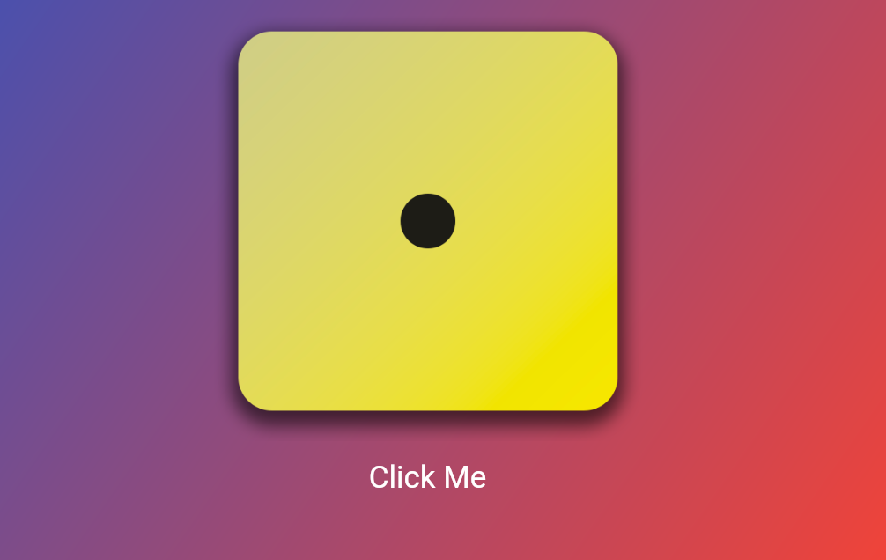

In this app:
- create basic app with dice
- use a math from dart - Random
- learn about class, variables and data types
- StatefullWidget vs StatelessWidget
- about widgets in flutter

This app look like this:

If you click on the button, the number of spots on the dice will also change